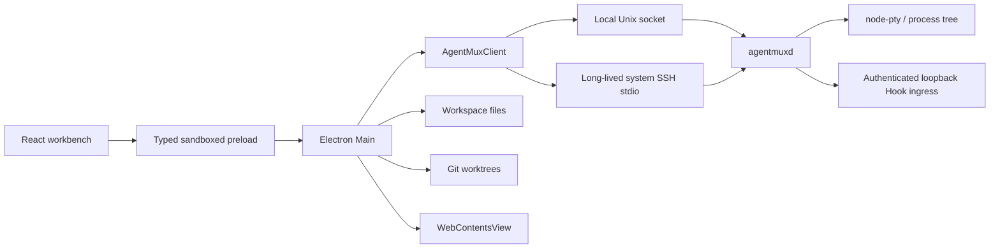

# AgentMux

AgentMux 是面向 Codex、Claude、TraeX、Hermes、Pi 等本地 Agent CLI 的可嵌入 Runtime，同时提供一个 Electron 桌面端作为第一方 Client。

长期架构已经修正为：`@agentmux/core` 负责 Provider、AgentSession、ACP、Hook、Permission、Resume 和类型安全的控制 API，`ctxmux` 是唯一 Run／PTY／进程 Owner。当前 HEAD 仍运行待替换的自建 `agentmuxd`；下面的命令和 API 描述当前可执行实现，不代表最终发布合同，也不再扩展为第二个 Run Kernel。T-015 对 ctxmux `b2bbc7a` 的公开 SDK、Local/SSH、可靠性和发布边界审计已经完成，当前缺口不足以开始原子替换，详见 [ctxmux 能力审计](docs/plans/ctxmux-capability-audit.md)。修正决策与删除边界见 [mux Runtime 架构决策](docs/plans/mux-runtime-decision.md)。

## 当前能力

- Local／SSH 共用同一份 Run 合同，只替换底层连接 Transport。
- Raw Terminal 与五个内置 Agent 共用 Create、Attach、Release Attachment、Write、Resize、Signal、Stop 和恢复边界。
- Output 使用单调 byte cursor、有界 Replay、显式 Gap 和 Client Ack，不轮询或保存整屏 Snapshot。
- Run、Agent Session、Attachment、View、Provider-native Resume 与 Respawn 是不同对象和动作。
- Native Hook、ACP、Terminal Output、Run Process 与 User Action 保留各自 Evidence Source，不从终端文本猜测 Tool、Permission、Reply correlation 或模型私有 Chain-of-thought。
- Desktop 支持 xterm、对话 Activity、Monaco 编辑器、文件树、拖拽分屏、Browser、Workspace、Branch／Worktree 和 Branch × Status 看板。
- Browser、文件系统和 Git Worktree 仍由 Electron Main 持有，不下沉到 Run Kernel。

## 当前过渡实现



主要边界：

- `AgentProvider` 声明 executable、Prompt Delivery、Ready Signal、Hook、Capability 和 Resume Plan。
- `AgentMuxClient` 把内部 Runtime 事实投影成 Kernel-neutral Run／Agent Session API，但不缓存终端字节或持有 PTY。
- 当前 Run Adapter 将 `runId + incarnationId` 映射到过渡 `agentmuxd`；最终 ctxmux 持有 PTY、进程树、增量 Output、Replay、Backpressure 和控制确认。
- Electron Main 只调用 Core Client，并持有配置、文件、Git、Browser 和 IPC 信任边界。
- Renderer 只消费 Typed Preload API；xterm 直接写入增量 Output，渲染后按 Sequence Ack。

a mature workbench 源码证据与采用边界见 [docs/a mature workbench-agent-runtime-notes.md](docs/a mature workbench-agent-runtime-notes.md)。
自建 daemon 阶段的数据流与 Package 文档保留为历史实现证据；其 keep／port／delete 处置见 [ctxmux 修正清单](docs/plans/ctxmux-correction-inventory.md)。

## 环境与验证

- Node.js 22 或更高版本。
- 通过 Corepack 使用仓库声明的 pnpm 版本。
- 创建 Worktree 的主机需要 Git。
- SSH Host 使用系统 OpenSSH 和用户已有认证。
- 目标主机需要相应 Agent CLI；AgentMux 不静默下载 Agent 或远端 Daemon。

```bash
corepack enable
pnpm install
pnpm check
```

构建并检查发布候选（不会 Publish）：

```bash
pnpm --filter @agentmux/core pack --pack-destination /tmp/agentmux-pack
node packages/core/bin/agentmux.js doctor --activate
node packages/core/bin/agentmux.js artifact create --output /tmp/agentmux-linux-arm64.tgz --build-id 0.1.0 --platform linux-arm64
```

## 使用 Core

下面的最小 Client 只使用包的公开 API。`dispose()` 只断开 Client 并释放 Attachment，不停止 Run；需要结束进程时必须显式调用 `stopAgent()` 或 `stopTerminal()`。

```ts
import {
  connectLocalAgentMux
} from '@agentmux/core'

const client = await connectLocalAgentMux()

const unsubscribe = client.onEvent((event) => {
  if (event.type === 'terminal-output') process.stdout.write(event.data)
})

const session = await client.createAgent({
  agentId: 'codex',
  workspacePath: '/srv/project',
  prompt: '检查失败测试，并说明最小正确修复。'
})

await client.writeAgent(session.agentSessionId, '先运行聚焦测试。\r')

unsubscribe()
await client.dispose()
```

新增 Agent 只需实现 `AgentProvider` 并注入 `AgentMuxClient`，不需要了解 Electron、Local Socket 或 SSH Connector。

## Hook 合同

每个 Agent Run 会收到：

- `AGENTMUX_RUN_ID`
- `AGENTMUX_RUN_INCARNATION_ID`
- `AGENTMUX_AGENT_SESSION_ID`
- `AGENTMUX_AGENT_ID`
- `AGENTMUX_HOOK_URL`
- `AGENTMUX_HOOK_TOKEN`

Agent 原生 Hook 向 `AGENTMUX_HOOK_URL` 发送带 Bearer Token 的 JSON：

```json
{
  "agentSessionId": "value from AGENTMUX_AGENT_SESSION_ID",
  "runId": "value from AGENTMUX_RUN_ID",
  "incarnationId": "value from AGENTMUX_RUN_INCARNATION_ID",
  "agentId": "codex",
  "eventName": "PreToolUse",
  "payload": {
    "tool_name": "Bash",
    "tool_input": { "command": "pnpm test" }
  }
}
```

Ingress 只监听 Run Kernel 所在主机的 `127.0.0.1`，并同时核对 Agent、Agent Session、Run 和 Incarnation。观察失败不会阻塞 Agent。全局 Hook 安装只能由用户显式执行 `preview -> install`，并带 Generation Check、Receipt 和可恢复卸载。

## Desktop

```bash
pnpm dev
```

macOS 开发启动会复用项目内 Electron Artifact 生成缓存的 `AgentMux.app`，并使用独立开发配置目录；Dock、系统应用列表与窗口身份均显示为 AgentMux，不覆盖正式用户配置或修改依赖中的 `Electron.app`。

只查看确定性演示数据：

```bash
pnpm dev:web
```

应用直接进入 Terminal-first Workbench。可以从侧栏加入本地目录，或在 Settings 中配置 SSH Host 和已显式安装的远端 Runtime。

### SSH 配置

1. 先确认系统 `ssh <host>` 使用现有配置和认证可以连接。
2. 当前过渡阶段使用 `agentmux artifact create` 构建目标平台 Artifact，并由运维流程显式安装、启动版本匹配的远端 Runtime；公共 Consumer 不再调用 daemon manager。
3. 在 Host 设置中填写 hostname、可选 user／port／identity path，以及 Runtime Build、Launcher、Entrypoint 和 Endpoint 绝对路径。
4. 使用 Test 核对 Host、Build 和 Protocol 身份。
5. 添加远端 Workspace 后，Terminal、Agent、文件和 Git 操作都会在同一 Host 上执行。

AgentMux 只保存连接元数据和可选 Identity File 路径，不读取、复制或保存 Private Key 内容。

## 仓库结构

```text
packages/core/       UI 无关的 Provider、Client、Runtime Adapter、Local／SSH Transport 与 Agent Session 合同
apps/desktop/        Electron Main／Preload 与 React 第一方 Client
docs/                中文设计、a mature workbench 源码证据、测试与 Feature 决策
```

## 当前限制

- 仓库不会自动修改用户全局 Codex、Claude、Hermes 或 Pi Hook 配置。
- SSH 自动化使用隔离的系统 SSH Fixture；不连接真实外部 Host，也不包含真实凭据。
- 当前 Package 候选声明 Node 22+、macOS／Linux、x64／arm64；Windows／ConPTY 不在支持范围。
- `node-pty` 精确锁定官方 `1.2.0-beta.15`，因为稳定版 1.1.0 的外部 Consumer 在 macOS 会遇到不可执行的 `spawn-helper`。
- 最终 ctxmux candidate 的长时间 Soak、安全矩阵和资源回归属于 T-017。
- 应用尚未签名、自动更新或发布。
