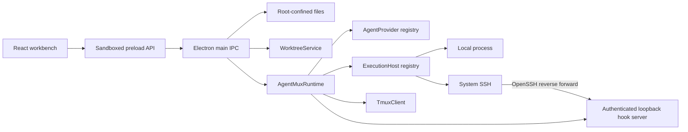

# AgentMux

AgentMux is a typed tmux runtime for CLI coding agents, plus an Electron workbench that proves the runtime through real terminal, activity, editor, workspace, and Git worktree flows.

It currently supports Codex, Claude, Hermes, and Pi on the local machine or a configured SSH host. tmux owns the persistent PTY and process. `@agentmux/core` owns provider command plans, session identity, lifecycle observation, and hook normalization. The desktop is a consumer of that package rather than a second agent runtime.

## What works

- Launch, discover, capture, resize, send input to, interrupt, and stop package-owned tmux sessions.
- Use one `ExecutionHost` contract for local commands and system-SSH commands.
- Build deterministic launch plans for Codex, Claude, Hermes, and Pi.
- Receive authenticated native-hook events and keep their provenance separate from tmux liveness and terminal output.
- View one session as either a raw xterm terminal or an observable activity conversation.
- Compose multiline prompts and insert the active file as an `@path` reference.
- Browse, edit, and save files inside a root-confined local or remote workspace.
- Use session tabs and workspace-specific persistent resizable splits.
- Navigate workspaces through a sidebar or an agent-state board.
- Explicitly create and register a local or SSH Git worktree; registration happens only after Git succeeds.

The activity view shows observable prompts, assistant messages, tool use, permissions, and lifecycle events. It does not expose or claim to expose private chain-of-thought.

## Architecture



The main boundaries are deliberately small:

- `AgentProvider` owns agent-specific executable and argument planning.
- `ExecutionHost` owns local-versus-SSH command transport and hook reachability.
- `TmuxClient` owns only `agentmux-*` tmux sessions and sends prompts through tmux buffers rather than shell interpolation.
- `AgentMuxRuntime` owns session state, polling, normalized events, and public controls.
- Electron main owns configuration, filesystem, Git, and IPC trust boundaries.
- React owns presentation and interaction only; it never imports Node, SSH, Git, or tmux primitives.

The a mature workbench mechanisms and extraction decisions that informed these boundaries are documented in [docs/a mature workbench-agent-runtime-notes.md](docs/a mature workbench-agent-runtime-notes.md).

## Prerequisites

- Node.js 22 or newer and pnpm 11.5.1 through Corepack.
- `tmux` on every execution host.
- `git` on hosts where worktrees will be created.
- The selected agent executable on the host where it will run.
- OpenSSH client for SSH hosts. The remote server must permit remote TCP forwarding for native hook delivery.
- macOS or Linux for the local desktop demonstrator. Remote workspaces are expected to be POSIX hosts.

Install and verify:

```bash
corepack enable
pnpm install
pnpm check
```

## Use the core package

```ts
import {
  AgentMuxRuntime,
  LocalExecutionHost,
  SshExecutionHost
} from '@agentmux/core'

const runtime = new AgentMuxRuntime({
  hosts: [
    new LocalExecutionHost(),
    new SshExecutionHost({
      id: 'buildbox',
      hostname: 'buildbox.example.com',
      user: 'river'
    })
  ]
})

await runtime.start()
const unsubscribe = runtime.onEvent((event) => {
  console.log(event.type, event)
})

const session = await runtime.launch({
  agentId: 'codex',
  hostId: 'buildbox',
  workspacePath: '/srv/project',
  prompt: 'Inspect the failing tests and explain the smallest correct fix.'
})

await runtime.send(session.id, 'Run the focused test next.')

unsubscribe()
await runtime.dispose()
```

Custom providers implement `AgentProvider` and register through the runtime's provider registry. They do not need to know whether tmux is local or remote.

## Native hook contract

Every launched process receives:

- `AGENTMUX_SESSION_ID`
- `AGENTMUX_AGENT_ID`
- `AGENTMUX_HOST_ID`
- `AGENTMUX_WORKSPACE_PATH`
- `AGENTMUX_HOOK_URL`
- `AGENTMUX_HOOK_TOKEN`

A configured native agent hook posts a JSON envelope to `AGENTMUX_HOOK_URL` with `Authorization: Bearer <AGENTMUX_HOOK_TOKEN>`:

```json
{
  "sessionId": "value from AGENTMUX_SESSION_ID",
  "agentId": "value from AGENTMUX_AGENT_ID",
  "eventName": "PreToolUse",
  "payload": {
    "tool_name": "Bash",
    "tool_input": { "command": "pnpm test" }
  }
}
```

The receiver listens only on local loopback. For an SSH host, `SshExecutionHost` creates one OpenSSH ControlMaster and dynamically allocates a remote-loopback reverse forward to that receiver. The same bearer-token check applies after SSH transport. Launch fails explicitly if the tunnel cannot be established.

AgentMux does not silently edit user-global Codex, Claude, Hermes, or Pi hook configuration. Hook installation is an explicit operator concern; without it, terminal output and tmux lifecycle remain available with their own provenance, but semantic activity is not fabricated from terminal text.

## Run the desktop

Start the Electron development app:

```bash
pnpm dev
```

For renderer-only visual work with deterministic demo data:

```bash
pnpm dev:web
```

The app starts on the terminal workbench. Add a local folder from the sidebar, or open **Settings & hosts** to add an SSH host. Provider command fields allow a different executable name or absolute executable path.

### SSH setup

1. Make sure `ssh <host>` succeeds through the system SSH client and existing agent/configuration.
2. Add the hostname, optional user and port in **Settings & hosts**.
3. Use **Test** to verify SSH and remote tmux together.
4. Add a remote workspace path or create a remote worktree.
5. Launch an agent; the provider, tmux commands, file operations, Git operations, and hook bridge all execute against that host.

AgentMux stores host selectors and an optional identity-file path. It never copies or persists private key contents.

### Create a worktree

1. Choose **Worktree** in the top bar, the worktree icon in the sidebar, or **New worktree** on the board.
2. Select the local or SSH execution host.
3. Enter repository path, new worktree path, new branch, and base reference.
4. Check the explicit Git confirmation.
5. Choose **Create & register**.

The main process runs this shape through an argument array:

```text
git -C <repository> worktree add -b <branch> -- <worktree-path> <base-ref>
```

On success, the resulting host-scoped workspace is registered and selected, its own split layout is restored, and the terminal-first launch surface is shown. A Git failure leaves no workspace record.

## Repository layout

```text
packages/core/       reusable Provider, ExecutionHost, tmux, hook, and runtime package
apps/desktop/        Electron main/preload plus React workbench
docs/                a mature workbench evidence and reviewed implementation decisions
```

## Current limits

- Native provider hooks are normalized and transported, but AgentMux does not install them into user-global agent settings.
- SSH transport and reverse forwarding are deterministically tested at the OpenSSH argv boundary; this repository does not contain live remote credentials for an end-to-end public-host test.
- The hook bridge belongs to the live runtime. tmux sessions survive desktop shutdown and are rediscovered with terminal/liveness evidence, but a prior process's hook URL is not claimed as active semantic evidence after shutdown.
- The demonstrator is not code-signed, packaged, auto-updated, or published.
- WSL transport, mobile clients, account management, and a mature workbench's daemon/relay protocol are intentionally outside this implementation.
